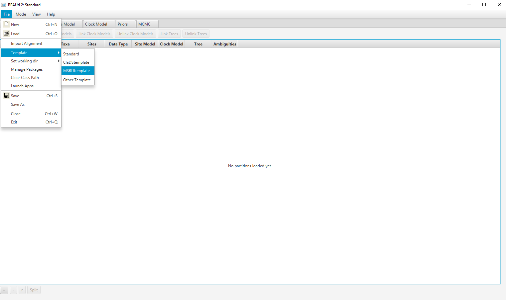
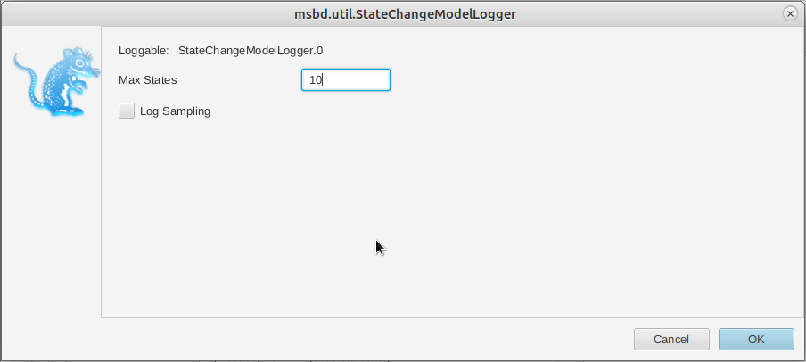

# Background

This is a template tutorial and style guide to help formatting Markdown tutorials. 

Please start the tutorial by adding some background about the tutorial in this section, clearly explaining the question/problem and the type of analysis that the methods in the tutorial should be used for. In the next section please add a short description of all the programs or packages used in the tutorial. The tutorial exercise should follow this part. Please add a short explanation on the dataset used in the tutorial before starting with the exercise. Please also add a section after the exercise interpreting the results. End your tutorial with some useful links.

Some of the text in this tutorial template is just dummy filler text. Please do not try to understand it.

----

# Programs used in this Exercise 

### BEAST2 - Bayesian Evolutionary Analysis Sampling Trees 2

BEAST2 is a free software package for Bayesian evolutionary analysis of molecular sequences using MCMC and strictly oriented toward inference using rooted, time-measured phylogenetic trees . This tutorial uses BEAST2 version 2.6.0.

### BEAUti -- Bayesian Evolutionary Analysis Utility

BEAUti is a utility program with a graphical user interface for creating BEAST2 input files, which are written in XML. The eXtensible Markup Language (XML) is a general-purpose markup language, which allows for the combination of text and additional information. The use of the XML makes analysis specification very flexible and readable by both the program and people. The XML file specifies all the components of the analysis, including sequences, node calibrations, models, priors, output file names.

### LogCombiner

When multiple (identical) analyses are run using BEAST2, LogCombiner can be used to combine the parameter log files or tree files into a single file that can then be analyzed or summarized using Tracer (for log files) or TreeAnnotator (for tree files). However, it is important to ensure that all analyses reached convergence and sampled the same stationary distribution before combining the parameter files.

### TreeAnnotator

TreeAnnotator is used to summarize the posterior sample of trees to produce a maximum clade credibility tree and summarize the posterior estimates of other parameters that can be easily visualized on the tree (e.g. node height). This program is also useful for comparing a specific tree topology and branching times to the set of trees sampled in the MCMC analysis. 

### Tracer

Tracer is used for assessing and summarizing the posterior estimates of the various parameters sampled by the Markov Chain. This program can be used for visual inspection and assessment of convergence and it also calculates 95\% credible intervals (which approximate the 95\% highest posterior density intervals) and effective sample sizes (ESS) of parameters. Contrary to the other software in this section, Tracer is not distributed with BEAST2 and needs to be downloaded separately [here](http://beast.community/tracer).

----

# Practical: lineage-specific birth and death rates inference

## Dataset: hummingbirds phylogeny

The dataset used in this tutorial is a time-calibrated phylogeny of 284 species of hummingbirds, which was estimated by . This phylogeny was built from an alignment of 436 sequences representing six genes (four nuclear and two mitochondrial).

In this tutorial, we focus on estimating the MSBD model and its parameters, and so we are going to fix this phylogeny in our analysis. However, it is also possible to co-estimate both the phylogeny and the MSBD model from an alignment in BEAST2.

## Setting up the XML file

This section will demonstrate how to create an XML configuration file using BEAUti, which will then be used to run the analysis in BEAST2.

### Package installation

The first step is to install the MSBD package, which will allow us to set up and run an analysis with lineage-specific birth and death rates.

> Open the **BEAST2 Package Manager** by navigating to **File > Manage Packages**. ([Figure 1](#packageManage1))
> 

<figure>
	<a id="packageManage1"></a>
	
	<figcaption>Figure 1: Finding the BEAST2 Package Manager.</figcaption>
</figure>
<br>


> Install the **MSBD** package by selecting it and clicking the **Install/Upgrade** button. ([Figure 2](#packageManage2))
> 

<figure>
	<a id="packageManage2"></a>
	
	<figcaption>Figure 2: The BEAST2 Package Manager.</figcaption>
</figure>
<br>


BEAUti needs to be restarted for the newly installed package to be loaded properly.

> Close the **BEAST2 Package Manager** and **_restart_** BEAUti to fully load the **MSBD** package.
> 

### Setting the templates

BEAUti uses templates to define specific model configurations. The MSBD template needs to be selected to set up an analysis using the MSBD model.

> Select the **MSBD template** by navigating to **File > Template**. ([Figure 3](#template))
> 

<figure>
	<a id="template"></a>
	
	<figcaption>Figure 3: Selecting the MSBD template.</figcaption>
</figure>
<br>

### Importing the alignment

This analysis will be run with a fixed tree topology, however BEAUti requires an alignment to be loaded in order to set the other components of the model. As a result, we will load a dummy alignment, which is just the sequence "A" for all taxa.

> In the **Partitions** panel, import the alignment by navigating to **File > Import Alignment** in the menu ([Figure 4](#importAlignment)) and then finding the `hummingbirds.nex` file on your computer **or** simply drag and drop the file into the **BEAUti** window.
> 

<figure>
	<a id="importAlignment"></a>
	
	<figcaption>Figure 4: Importing the alignment into BEAUti.</figcaption>
</figure>
<br>


### Importing the tree

As mentioned earlier, we want to run this analysis with a fixed tree topology. By default BEAUti generates a random starting tree compatible with the alignment, so we need to change this to our fixed tree.

> In the **Tree** panel, set the dropdown to **Tree From Newick**.
> Copy-paste the Newick tree found in the `hummingbirds.MCC.tre` file into the **Newick** field.
> Uncheck the **Estimate Topology** checkbox.
>

The final tree configuration is shown in [Figure 5](#importTree).

<figure>
	<a id="importTree"></a>
	
	<figcaption>Figure 5: Importing the tree into BEAUti.</figcaption>
</figure>
<br>

### The parameter priors

The next step is to look at the parameter priors, in the **Priors** panel. The default priors on the birth rates (), death rates () and total number of states () are reasonable for this dataset so we will not change them.

The expected average number of state changes across the entire tree is given by , where L is the total length of the tree. The length of the fixed tree used in this analysis is , so the default prior on  would lead to a high expected number of state changes. From the previous analysis performed in BAMM, we expect only a few state changes across this phylogeny, so we will set the prior on  to a lower range, using a **LogNormal(-4.0, 1.0)** distribution.

>  Click on the arrow next to **gamma** and change the value for **M** (mean) of the default log normal distribution to -4 ([Figure 6](#gammaPrior)).
> 

<figure>
	<a id="gammaPrior"></a>
	
	<figcaption>Figure 6: Setting the prior on the state change rate.</figcaption>
</figure>
<br>

### The tree prior

Next, we will specify the tree prior, i.e. the MSBD model. By default most of the parameters of the model are estimated, so it is not necessary to change their starting values. However, the extant sampling proportion () and extinct sampling probability () are fixed. There are no extinct samples in this dataset, and we have sampled 86% of the extant hummingbirds species so we will set  and .

>  Click on the arrow next to **Tree** and change the value for **rho** (extant sampling proportion) of the MSBD model to 0.86 ([Figure 7](#treePrior)).
> 

<figure>
	<a id="treePrior"></a>
	
	<figcaption>Figure 7: Setting the MSBD tree prior.</figcaption>
</figure>
<br>

Note that many other options are available in this section, such as fixing the number of states or the value of some parameters (**estimate** checkboxes), setting the birth rate or the death rate to be shared between states (**identical across states** checkboxes), or setting the model to only use sampling-through-time (**To The Present** checkbox) .

### MCMC options

The next step is to set the options for running the chain, in the **MCMC** panel. We can see that several loggers are set by default:

- the regular trace log, which in our case only records the posterior, likelihood and prior, as we are not using a substitution or clock model.
- the screenlog, which shows the advancement of the chain to the screen
- the tree log, which will log the trees in Nexus format, with the birth and death rate on each edge as metadata
- the state change model log, which logs the parameters associated with the model, i.e. , , the number of sampled states and the birth and death rates for each state
- the tip rates log, which logs the birth and death rates at each tip (optionally, at each node if the **nodeLog** option is activated)
 
These last three logs are specific to MSBD. The only thing we will change here is the number of states recorded in the model. By default, only the sampled states are recorded, however this results in a log that is not in table format and so cannot be easily loaded into Tracer. Fixing the number of recorded states solves this problem.

>  In the **MCMC** panel, click on the arrow next to **stdStateslog** and click on the  **Edit** button to the right of the **StateChangeModelLogger** ([Figure 8](#logs)).
> 

<figure>
	<a id="logs"></a>
	
	<figcaption>Figure 8: Opening the state change model log.</figcaption>
</figure>
<br>

>  In the new panel, set the value of **maxStates** to 10 ([Figure 9](#logpanel)).
>  Close the panel by clicking on **OK**.
>

<figure>
	<a id="logs"></a>
	
	<figcaption>Figure 9: Setting the state change model log.</figcaption>
</figure>
<br>

Once all the options have been set, the final step is to save the XML.

> Save the XML file as `hummingbirds.xml` by navigating to **File > Save**.
> 

## Running the analysis in BEAST2

> Start **BEAST2** and choose the file `hummingbirds.xml`. 
> 
> If you have **BEAGLE** installed tick the box to **Use BEAGLE library if available**, which will make the run faster.
>
> Hit **Run** to start the analysis.
> 

The run should take about 15-20 minutes.

## Analyzing the output

### Output files

### Analyzing the log files

### Analyzing the trees

# Useful Links

- [Bayesian Evolutionary Analysis with BEAST 2](http://www.beast2.org/book.html) 
- BEAST 2 website and documentation: [http://www.beast2.org/](http://www.beast2.org/)
- BEAST 1 website and documentation: [http://beast.bio.ed.ac.uk](http://beast.bio.ed.ac.uk)
- Join the BEAST user discussion: [http://groups.google.com/group/beast-users](http://groups.google.com/group/beast-users) 

----

# Relevant References



-------

# Tutorial style guide


## Figures


<figure>
	<a id="fig:example1"></a>
	
	<figcaption>Figure 1: This figure is 25% of the page width.</figcaption>
</figure>


<figure>
	<a id="fig:example2"></a>
	
	<figcaption>Figure 2: This figure is only 10% of the page width.</figcaption>
</figure>


# Code

A bit of inline monospaced font can be made `like this`. Larger code blocks can be made by using the code environment:

Java:

```java
public class HelloWorld {

    public static void main(String[] args) {
        // Prints "Hello, World" to the terminal window.
        System.out.println("Hello, World");
    }

}
```

XML:

```xml
	<BirthDeathSkylineModel spec="BirthDeathSkylineModel" id="birthDeath" tree="@tree" contemp="true">
	      <parameter name="origin" id="origin" value ="100" lower="0."/>    
	      <parameter name="R0" id="R0" value="2" lower="0." dimension ="10"/>
	      <parameter name="becomeUninfectiousRate" id="becomeUninfectiousRate" value="1" lower="0." dimension ="10"/>
	      <parameter name="samplingProportion" id="samplingProportion" value="0."/>
	      <parameter name="rho" id="rho" value="1e-6" lower="0." upper="1."/>
	</BirthDeathSkylineModel>
```

R:

```R
	> myString <- "Hello, World!"
	> print (myString)
	[1] "Hello, World!"
```

# Equations

Inline equations: 

Displayed equations: 



## Instruction boxes

Use block-quotes for step-by-step instruction that the user should perform (this will produce a framed box on the website):

> The data we have is not the data we want, and the data we need is not the data we have.
> 
> We can input **any** formatted text in here:
>
> - Even
> - Lists
>
> or equations:
>
> 


# Hyperlinks

Add links to figures like this: 

- [Figure 1](#fig:example1) is 25% of the page width.
- [Figure 2](#fig:example2) is 10% of the page width. 

Add links to external URLs like [this](http://www.google.com). 

Links to equations or different sections within the same document are a little buggy.


----


