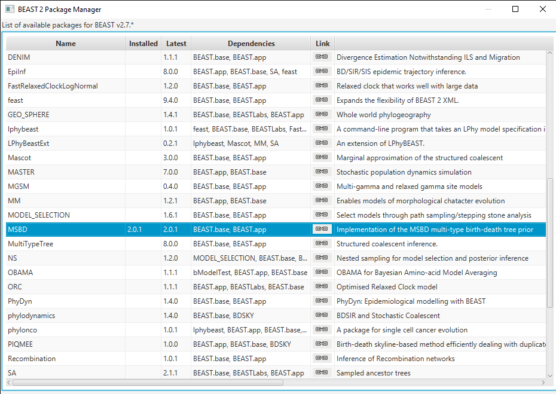
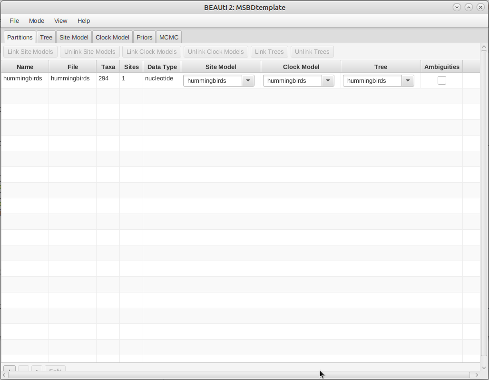
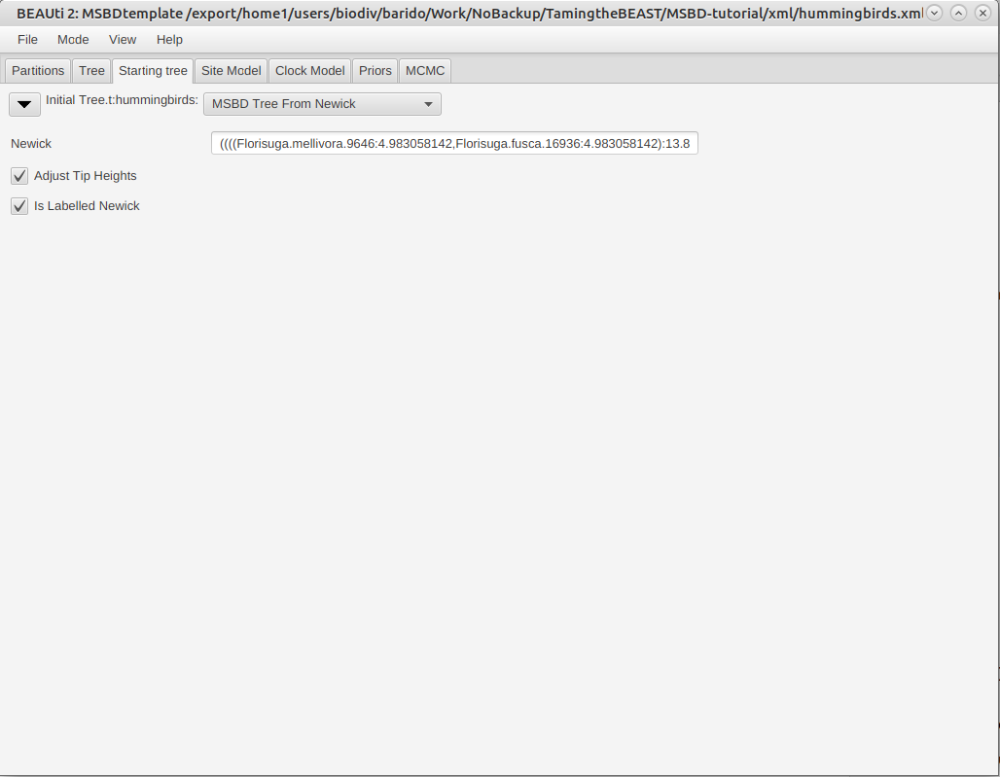
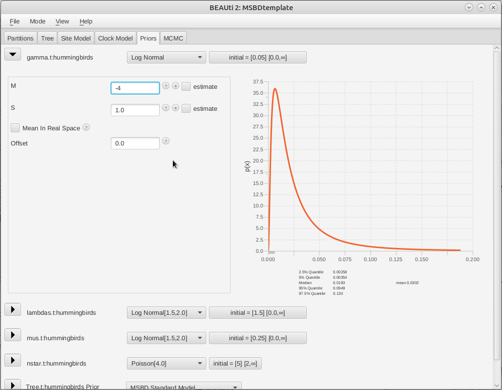
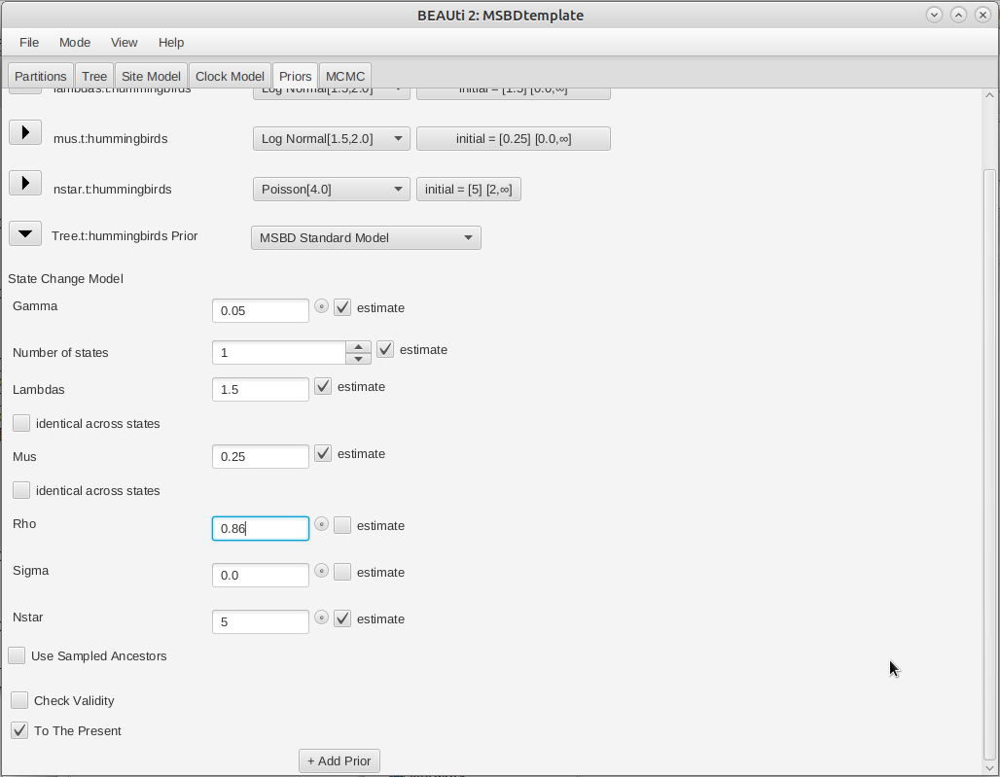

# Background

This tutorial will show how to configure and run a model with lineage-dependent birth and death rates, using the BEAST2 package MSBD.

The MSBD package relies on a multi-type birth death model which is composed of a number of evolutionary regimes, also called types or states, .

Each type is associated with a birth rate  and a death rate . A lineage in type  will change to any another type  with a uniform rate , where  is the total type change rate.
The MSBD package is able to infer ,  and  and  for all types, as well as the locations of types and type changes on the tree.

More details on the model and an evaluation of its performance in various conditions can be found in the original publication .

You may notice similarities between MSBD and the model used in another BEAST2 package, BDMM. The main difference is that MSBD is able to infer the number of types as well as the types at the tips of the tree, whereas BDMM requires you to fix them. Thus MSBD is more appropriate if the character driving the differences in rates is unobserved or unknown. On the other hand, BDMM integrates more complex dynamics than the current implementation of MSBD: in particular, it includes asymmetrical transition rates as well as mixed birth events (where the two lineages produced by a birth event are of different types), which are not currently available in MSBD.

----

# Programs used in this Exercise 

### BEAST2 - Bayesian Evolutionary Analysis Sampling Trees 2

BEAST2 is a free software package for Bayesian evolutionary analysis of molecular sequences using MCMC and strictly oriented toward inference using rooted, time-measured phylogenetic trees . This tutorial uses BEAST2 version 2.7.4.

### BEAUti -- Bayesian Evolutionary Analysis Utility

BEAUti is a utility program with a graphical user interface for creating BEAST2 input files, which are written in XML. The eXtensible Markup Language (XML) is a general-purpose markup language, which allows for the combination of text and additional information. The use of the XML makes analysis specification very flexible and readable by both the program and people. The XML file specifies all the components of the analysis, including sequences, node calibrations, models, priors, output file names.

### TreeAnnotator

TreeAnnotator is used to summarize the posterior sample of trees to produce a maximum clade credibility tree and summarize the posterior estimates of other parameters that can be easily visualized on the tree (e.g. node height). This program is also useful for comparing a specific tree topology and branching times to the set of trees sampled in the MCMC analysis. 

### Tracer

Tracer is used for assessing and summarizing the posterior estimates of the various parameters sampled by the Markov Chain. This program can be used for visual inspection and assessment of convergence and it also calculates 95% credible intervals (which approximate the 95% highest posterior density intervals) and effective sample sizes (ESS) of parameters. Contrary to the other software in this section, Tracer is not distributed with BEAST2 and needs to be downloaded separately [here](http://beast.community/tracer).

----

# Practical: Lineage-specific Birth and Death Rate Inference

## Dataset: Hummingbird Phylogeny

The dataset used in this tutorial is a time-calibrated phylogeny of 284 species of hummingbirds, which was estimated by . This phylogeny was built from an alignment of 436 sequences representing six genes (four nuclear and two mitochondrial).

In this tutorial, we focus on estimating the MSBD model and its parameters, and so we are going to fix this phylogeny in our analysis. However, it is also possible to co-estimate both the phylogeny and the MSBD model from an alignment in BEAST2.

## Setting up the XML file

This section will demonstrate how to create an XML configuration file using BEAUti, which will then be used to run the analysis in BEAST2.

### Package installation

The first step is to install the MSBD package, which will allow us to set up and run an analysis with lineage-specific birth and death rates.

> Open the **BEAST2 Package Manager** by navigating to **File > Manage Packages**. ([Figure 1](#packageManage1))
> 

<figure>
	<a id="packageManage1"></a>
	
	<figcaption>Figure 1: Finding the BEAST2 Package Manager.</figcaption>
</figure>
<br>


> Install the **MSBD** package by selecting it and clicking the **Install/Upgrade** button. ([Figure 2](#packageManage2))
> 

<figure>
	<a id="packageManage2"></a>
	
	<figcaption>Figure 2: The BEAST2 Package Manager.</figcaption>
</figure>
<br>


BEAUti needs to be restarted for the newly installed package to be loaded properly.

> Close the **BEAST2 Package Manager** and **_restart_** BEAUti to fully load the **MSBD** package.
> 

### Setting the templates

BEAUti uses templates to define specific model configurations. The MSBD template needs to be selected to set up an analysis using the MSBD model.

> Select the **MSBD template** by navigating to **File > Template**. ([Figure 3](#template))
> 

<figure>
	<a id="template"></a>
	
	<figcaption>Figure 3: Selecting the MSBD template.</figcaption>
</figure>
<br>

### Importing the alignment

This analysis will be run with a fixed tree topology, however BEAUti requires an alignment to be loaded in order to set the other components of the model. As a result, we will load a dummy alignment, which is just the sequence "A" for all taxa.

> In the **Partitions** panel, import the alignment by navigating to **File > Import Alignment** in the menu ([Figure 4](#importAlignment)) and then finding the `hummingbirds.nex` file on your computer **or** simply drag and drop the file into the **BEAUti** window.
> 

<figure>
	<a id="importAlignment"></a>
	
	<figcaption>Figure 4: Importing the alignment into BEAUti.</figcaption>
</figure>
<br>


### Importing the tree

As mentioned earlier, we want to run this analysis with a fixed tree topology. By default BEAUti generates a random starting tree compatible with the alignment, so we need to change this to our fixed tree.

> In the **Tree** panel, set the dropdown to **Tree From Newick**.
> Copy-paste the Newick tree found in the `hummingbirds.MCC.tre` file into the **Newick** field.
> Uncheck the **Estimate Topology** checkbox.
>

The final tree configuration is shown in [Figure 5](#importTree).

<figure>
	<a id="importTree"></a>
	
	<figcaption>Figure 5: Importing the tree into BEAUti.</figcaption>
</figure>
<br>

### The parameter priors

The next step is to look at the parameter priors, in the **Priors** panel. The default priors on the birth rates (), death rates () and total number of types () are reasonable for this dataset so we will not change them.

The expected average number of type changes across the entire tree is given by , where L is the total length of the tree. The length of the fixed tree used in this analysis is , so the default prior on  would lead to a high expected number of type changes. From the previous analysis performed in BAMM, we expect only a few type changes across this phylogeny, so we will set the prior on  to a lower range, using a **LogNormal(-4.0, 1.0)** distribution.

>  Click on the arrow next to **gamma** and change the value for **M** (mean) of the default log normal distribution to **-4** ([Figure 6](#gammaPrior)).
> 

<figure>
	<a id="gammaPrior"></a>
	
	<figcaption>Figure 6: Setting the prior on the type change rate.</figcaption>
</figure>
<br>

### The tree prior

Next, we will specify the tree prior, i.e. the MSBD model. By default most of the parameters of the model are estimated, so it is not necessary to change their starting values. However, the extant sampling proportion () and extinct sampling probability () are fixed. There are no extinct samples in this dataset, and we have sampled 86% of the extant hummingbirds species so we will set  and .

>  Click on the arrow next to **Tree** and change the value for **rho** (extant sampling proportion) of the MSBD model to **0.86** ([Figure 7](#treePrior)).
> 

<figure>
	<a id="treePrior"></a>
	
	<figcaption>Figure 7: Setting the MSBD tree prior.</figcaption>
</figure>
<br>

Note that many other options are available in this section, such as fixing the number of states or the value of some parameters (**estimate** checkboxes), setting the birth rate or the death rate to be shared between states (**identical across states** checkboxes), or setting the model to only use sampling-through-time (**To The Present** checkbox) .

### MCMC options

The next step is to set the options for running the chain, in the **MCMC** panel. We can see that several loggers are set by default:

- the regular trace log, which in our case only records the posterior, likelihood and prior, as we are not using a substitution or clock model.
- the screenlog, which shows the advancement of the chain to the screen.
- the tree log, which will log the trees in Nexus format, with the birth and death rate on each edge as metadata.
- the state change model log, which logs the parameters associated with the model, i.e. , , the number of sampled states and the birth and death rates for each state ( and ).
- the tip rates log, which logs the birth and death rates at each tip (optionally, at each node if the **nodeLog** option is activated).
 
These last three logs are specific to MSBD. The only thing we will change here is the number of states recorded in the model. By default, only the sampled states are recorded, however this results in a log that is not in table format and so cannot be easily loaded into Tracer. Fixing the number of recorded states solves this problem.

>  In the **MCMC** panel, click on the arrow next to **stdStateslog** and click on the  **Edit** button to the right of the **StateChangeModelLogger** ([Figure 8](#logs)).
> 

<figure>
	<a id="logs"></a>
	
	<figcaption>Figure 8: Opening the state change model log.</figcaption>
</figure>
<br>

>  In the new panel, set the value of **maxStates** to 10 ([Figure 9](#logpanel)).
>  Close the panel by clicking on **OK**.
>

<figure>
	<a id="logpanel"></a>
	
	<figcaption>Figure 9: Setting the state change model log.</figcaption>
</figure>
<br>

Once all the options have been set, the final step is to save the XML.

> Save the XML file as `hummingbirds.xml` by navigating to **File > Save**.
> 

## Running the analysis in BEAST2

> Start **BEAST2** and choose the file `hummingbirds.xml`. 
> 
> If you have **BEAGLE** installed tick the box to **Use BEAGLE library if available**, which will make the run faster.
>
> Hit **Run** to start the analysis.
> 

The run should take about 15-20 minutes.

## Analyzing the output

### Output files

Our run has generated 4 different files:

* `hummingbirds.log` which is the general trace log.
* `hummingbirds.hummingbirds.states.log` which recorded the parameters associated with the state model.
* `hummingbirds.hummingbirds.rates.log` which recorded the rates on tips of the tree.
* `hummingbirds.hummingbirds.rates.trees` which recorded the sampled trees in Nexus format.

### Analyzing the log files

We will use the software Tracer to analyze the log files. The general trace log is not very interesting in our case, as we used a fixed tree. Next, we will look at the MSBD model log, contained in the file `hummingbirds.hummingbirds.states.log`.
[Figure 10](#gamma) shows the estimated posterior distribution for the type change rate, which in this analysis has a median estimate of 5.35E-3, with a 95% HPD of [4.04E-4 ; 0.014].

<figure>
	<a id="gamma"></a>
	
	<figcaption>Figure 10: Estimated posterior distribution of the type change rate, as shown in Tracer.</figcaption>
</figure>
<br>

One important thing to note is that the estimates of `lambda` and `mu` in this log should not be directly used. This is due to the fact that the types in our model are not tied to tips, so they may not represent the same evolutionary regimes in all samples. For instance, in the presence of two regimes, there may be samples where type 0 corresponds to the regime with higher birth, while in other samples this regime is represented by type 1. We can see this in [Figure 11](#lbda), where the estimate for `lambda_0` shows a discrepancy around 6.5E7 samples, which corresponds to `lambda_0` and `lambda_1` exchanging values. This also means that ESS values for these parameters may be low even if the chain has converged.

<figure>
	<a id="lbda"></a>
	
	<figcaption>Figure 11: Trace of the birth rate for type 0, as shown in Tracer.</figcaption>
</figure>
<br>

In order to look at the actual birth and death rates estimates, we can look at the tip rates log, stored in the file `hummingbirds.hummingbirds.rates.log`. [Figure 12](#tip_uni) and [Figure 13](#tip_bi) show examples of the estimated posterior distributions of the birth rate for two different tips. 

<figure>
	<a id="tip_uni"></a>
	
	<figcaption>Figure 12: Estimated posterior distribution of the birth rate at tip Topaza.pella, as shown in Tracer.</figcaption>
</figure>
<br>

<figure>
	<a id="tip_bi"></a>
	
	<figcaption>Figure 13: Estimated posterior distribution of the birth rate at tip Amazilia.leucogaster, as shown in Tracer.</figcaption>
</figure>
<br>

We can see that these two tips present two very different configurations. The first tip shows a unimodal posterior distribution, which indicates that it is confidently assigned to one particular evolutionary regime. On the other hand, the second tip presents a bimodal distribution, indicating that there are two distinct evolutionary regimes, with two distinct birth rates, which it can be assigned to. 
This is important to note because the usual metrics used to summarize posterior distributions, i.e. the median and 95% HPD interval, work well in the first case but can give a misleading representation of the posterior in the second case. In this case the median estimate for the birth rate of _Amazilia.leucogaster_ is 0.40, which corresponds approximately to the second mode of the distribution, however neither the median nor the 95% HPD interval show the existence of a second possible regime, with birth rate 0.22.

### Analyzing the trees

Another way to visualize the results is to look at the rates as plotted on the tree. We can use TreeAnnotator to build an MCC tree from the tree log in the file `hummingbirds.hummingbirds.rates.trees`. Since we also logged the birth and death rates for each edge in the tree log, these parameters will also be summarized along with the tree.

> Start **TreeAnnotator** and set the input tree to the tree log file.
>
> Set the burn-in percentage to 10%.
> 
> Give a name to the output file, for instance `hummingbirds.MCC.tre`.
>
> Finally, click **Run** to start the summary.

The MCC tree can be loaded into any tree visualization software, such as FigTree or IcyTree. We are going to use the R script provided in this tutorial `plot_MCC.R`. This script takes as input the MCC tree file and an output file to store the plot, and it will plot the MCC tree with edges coloured by the median estimates of the birth and death rates.
Run the following commands in an R console to create the plots:

```R
source("plot_MCC.R")
MCC_colour_plot("hummingbirds.MCC.tre", plotfile = "hummingbirds_MCC.pdf")
```

[Figure 14](#mcc_birth) and [Figure 15](#mcc_death) show the resulting plots for the birth rate and the death rate, respectively.

<figure>
	<a id="mcc_birth"></a>
	
	<figcaption>Figure 14: MCC tree with edges coloured by the median birth rate.</figcaption>
</figure>
<br>

<figure>
	<a id="mcc_death"></a>
	
	<figcaption>Figure 15: MCC tree with edges coloured by the median death rate.</figcaption>
</figure>
<br>

We can see that while most of the tree shares one evolutionary regime (in red), some clades are inferred to have evolved under a second regime (in green), with higher birth and death rates. 
From this figure it is not possible to tell whether the clades coloured in yellow-orange represent a third intermediate regime, or whether there is uncertainty as to which of the two regimes they belong to.

Going back to the rates log file and using the full posterior distribution rather than just the median, we see that the intermediate colour is likely due to uncertainty rather than a third regime.

# Useful Links

- [Bayesian Evolutionary Analysis with BEAST 2](http://www.beast2.org/book.html) 
- BEAST 2 website and documentation: [http://www.beast2.org/](http://www.beast2.org/)
- BEAST 1 website and documentation: [http://beast.bio.ed.ac.uk](http://beast.bio.ed.ac.uk)
- Join the BEAST user discussion: [http://groups.google.com/group/beast-users](http://groups.google.com/group/beast-users) 

----

# Relevant References



-------
